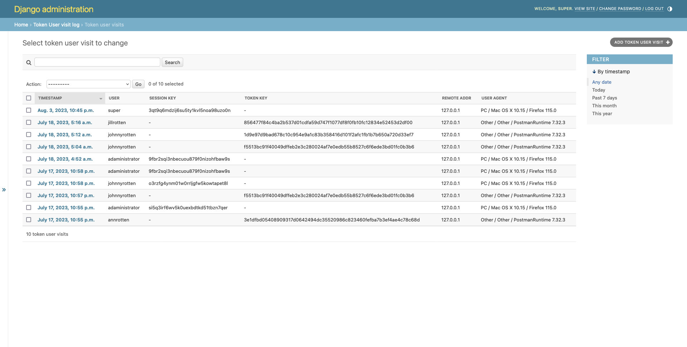
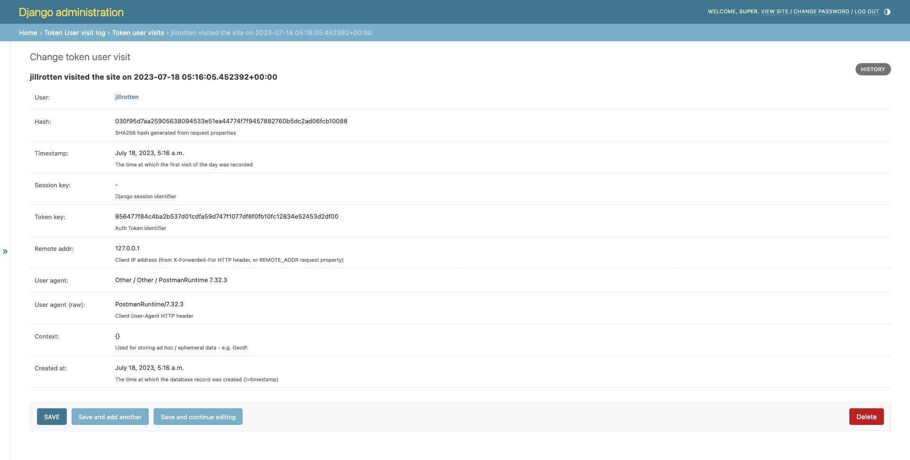

# Django Token User Visit

[](https://github.com/psf/black)
[](https://github.com/dlondonmedina/django-token-user-visit/actions/workflows/ci.yml?query=branch%3Amain)

_Django app for recording daily user visits_

# Project Description

This app consists of middleware to record user visits, and a single `TokenUserVisit` model to capture that data. 

There are two Middleware components available: `TokenUserVisitMiddleware` does the work of logging user visit. However, it depends on the `request.user` being established. This is not the case if the user is using token based authentication. `RequestUserSetterMiddleware` establishes the `request.user` instance if it has not yet been set.

The principal behind this is _not_ to record every single request made by a user. It is to record each daily visit to a site.

This app is configured to track user visits using both Sessions and Authentication tokens. Since the goal is to record a daily visit per ip per device, only the first visit from each device and IP and login will be recorded each day. However, if a user logs out, causing the session or authentication token to be purged, a new daily visit may be recorded on the same day. Likewise, if a user logs in from several different devices and different IP addresses, a new user visit will be recorded for each device.

The goal is to record unique daily visits per user 'context' ( where context is the location /
device combo).

## Requirements

- Python 3.8+
- Django 3.2, 4.1, 4.2
- Python User Agents 2.1+

## Installation

Install with pip:

```bash
pip install django-token-user-visit
```

Add _django-token-user-visit_ to your _INSTALLED_APPS_

```
INSTALLED_APPS = [
    ...
    "token_user_visit",
]
```

Add the Django Token User Visit Middleware:

```
MIDDLEWARE = [
    ...
    "token_user_visit.middleware.RequestUserSetterMiddleware",
    ...
    "token_user_visit.middleware.TokenUserVisitMiddleware",
]
```

*NOTE:*
The `RequestUserSetterMiddleware` must come before the `TokenUserVisitMiddleware` and must follow the `SessionMiddleware` and any authentication middleware you are using. 

## Settings

**TOKEN_USER_VISIT_RECORDING_DISABLED**

Default: `False`

This can be set as an environment variable or in your `settings.py` and if set to `True` user visits are not recorded.

**TOKEN_USER_VISIT_RQUEST_CONTEXT_EXTRACTOR**

Default: `{}`

This is set to a function that returns a dictionary of additional information to be stored. An example might be GeoIP information.

**TOKEN_USER_VISIT_CONTEXT_ENCODER**

Default: `DjangoJSONEncoder`

This can override the JSON encoder used for context JSON fields

**TOKEN_USER_VISIT_RECORDING_BYPASS**

Default: `False`

This setting is a function that takes an HttpRequest and returns a boolean. If it evaluates to true, the user visit is not recorded. For instance if you want to ignore visits to Django Admin, you could add this to `settings.py`

```python
TOKEN_USER_VISIT_RECORDING_BYPASS = lambda request: request.path.startswith("/admin/")
```

**TOKEN_USER_VISIT_DUPLICATE_LOG_LEVEL**

Default: `warning`

The log level to use when logging duplicate hashes. This is WARNING by default, but if it's noisy you can turn this down by setting this value. Must be one of "debug", "info", "warning", "error"

**TOKEN_USER_VISIT_SESSION_ACTIVATOR**

Default: `False`

By default, the Middleware logs a token first even if there is an active session. This setting is a function that takes an HttpRequest and returns a boolean. If True, it logs the session instead of the token.

**TOKEN_USER_VISIT_AUTHENTICATION_CLASS**

Default: `None` 
*Required*

The authentication class used for Token based authentication.

**TOKEN_USER_VISIT_KEYWORD**

Default: `Bearer`

This allows you to modify the Keyword identifying the token to something else. Generally this will be `Bearer`


## Previews

Admin list view:



Admin edit view:



